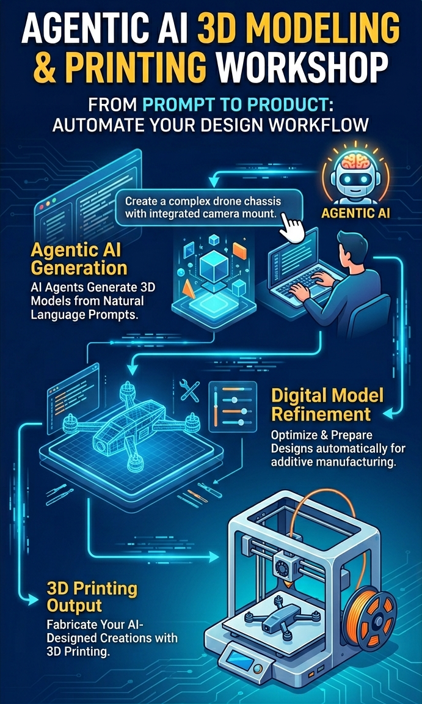

# Workshop for AI empowered Modeling and 3D Printing

This repository contains materials for a workshop on using AI tools to enhance 3D modeling and printing workflows. The workshop covers topics such as: Blender basics, AI-assisted modeling techniques, OpenSCAD for parametric modeling, and integrating AI into the 3D printing process.



## Clone this Repository

To access the workshop materials, you can clone [this repository](https://github.com/hkbu-kennycheng/ai-3dprint-workshop.git) to your local machine using the following command:

```bash
git clone https://github.com/hkbu-kennycheng/ai-3dprint-workshop.git
```

Or you can download the ZIP file from the GitHub page and extract it to your desired location.

## Workshop Materials

### Setup Guides

- [GitHub Account Creation Guide](github-signup-guide.md) — Step-by-step instructions for creating a GitHub account using Google sign-in.
- [VS Code Installation Guide for Windows](vscode-guide/vscode-installation-guide.md) — Detailed walkthrough for installing Visual Studio Code on Windows, including troubleshooting tips for common issues.
- [Blender Installation Guide for Windows](blender-guide/install-blender-windows.md) — Comprehensive instructions for installing Blender on Windows, configuring GPU rendering, and verifying the installation.

### Tutorials

- [Agentic Blender Modeling Tutorial](agentic-blender-modeling.md) — A tutorial on using Blender for 3D modeling, including tips for leveraging AI tools to enhance the modeling process.
