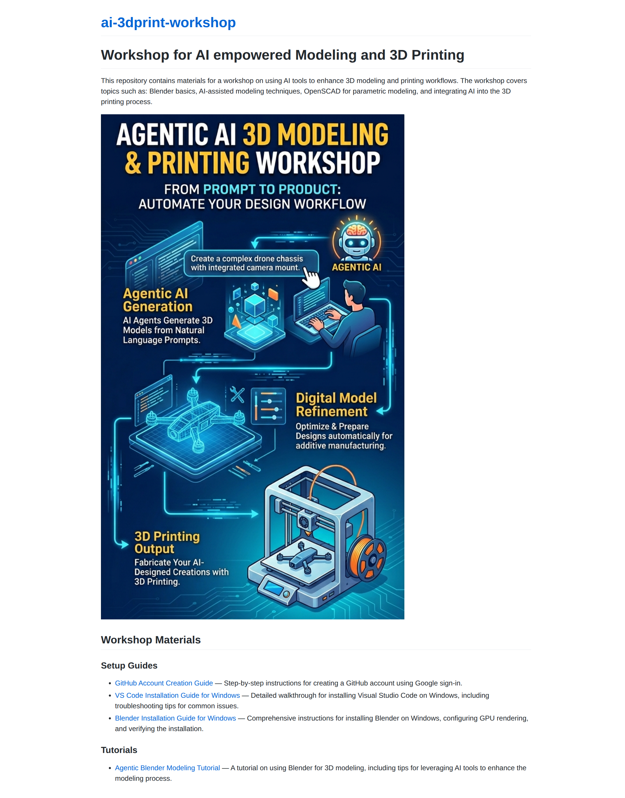

# Accessing the Workshop Materials

This guide shows you how to access the workshop documents at **[https://hkbu-kennycheng.github.io/ai-3dprint-workshop/](https://hkbu-kennycheng.github.io/ai-3dprint-workshop/)**.

---

## Step 1 — Open the Workshop Website

Open your browser and go to:

```
https://hkbu-kennycheng.github.io/ai-3dprint-workshop/
```

You will see the workshop homepage:



---

## Step 2 — Find the Document You Need

The homepage lists all available materials under two sections.

### Setup Guides

| Document | Description |
|---|---|
| [GitHub Account Creation Guide](https://hkbu-kennycheng.github.io/ai-3dprint-workshop/github-signup-guide.html) | Step-by-step instructions for creating a GitHub account using Google sign-in |
| [VS Code Installation Guide for Windows](https://hkbu-kennycheng.github.io/ai-3dprint-workshop/vscode-guide/vscode-installation-guide.html) | Walkthrough for installing Visual Studio Code on Windows |
| [Blender Installation Guide for Windows](https://hkbu-kennycheng.github.io/ai-3dprint-workshop/blender-guide/install-blender-windows.html) | Instructions for installing Blender on Windows and configuring GPU rendering |

### Tutorials

| Document | Description |
|---|---|
| [Agentic Blender Modeling Tutorial](https://hkbu-kennycheng.github.io/ai-3dprint-workshop/agentic-blender-modeling.html) | Using Blender for 3D modeling with AI tools |

---

## Step 3 — Click a Link to Open a Document

Click any link in the list to open that document. Each page contains detailed step-by-step instructions with screenshots.

To return to the homepage at any time, click the **`ai-3dprint-workshop`** link at the top of any page.
