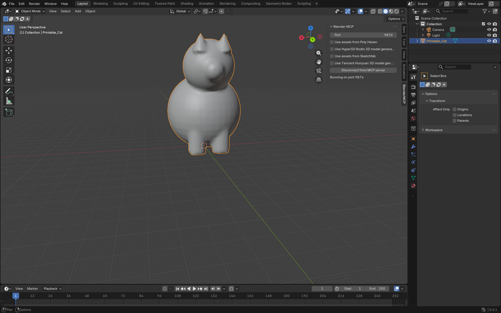
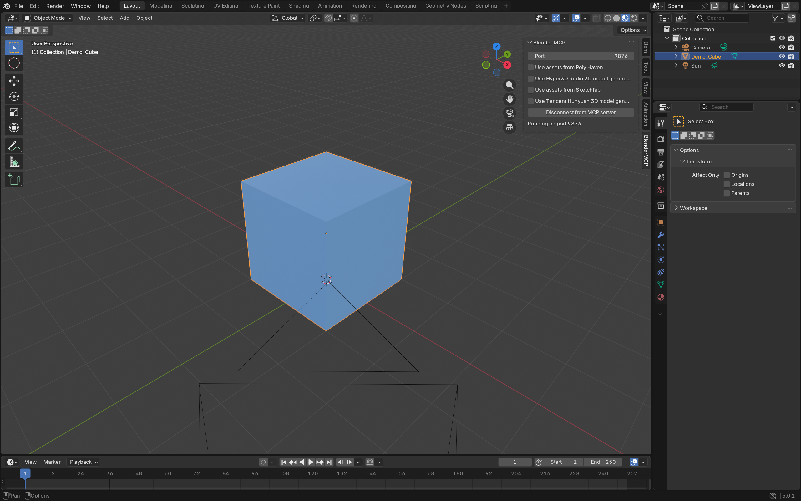
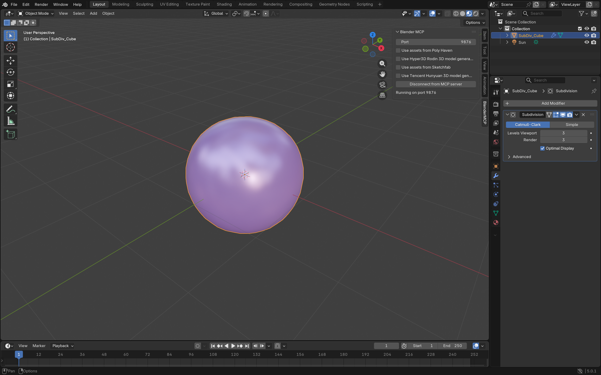
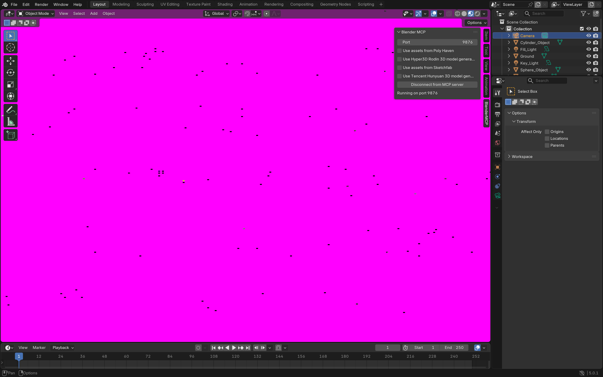
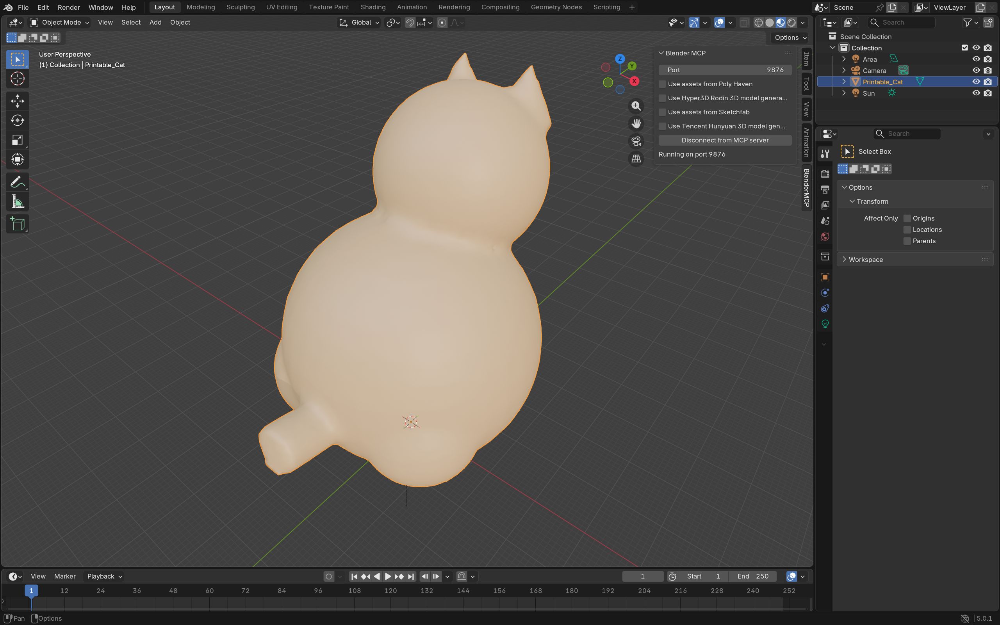

# Agentic Blender Modeling Tutorial

A comprehensive guide to AI-assisted 3D modeling using Blender and the Model Context Protocol (MCP). This tutorial covers Blender fundamentals, BlenderMCP setup, and hands-on examples of creating 3D models through natural language commands.



---

## Table of Contents

1. [Prerequisites](#prerequisites)
2. [Getting Started with Blender](#getting-started-with-blender)
3. [Basic Modeling Techniques](#basic-modeling-techniques)
4. [Understanding Blender MCP](#understanding-blender-mcp)
5. [Installing BlenderMCP](#installing-blendermcp)
6. [Configuring AI Clients](#configuring-ai-clients)
7. [BlenderMCP Tool Reference](#blendermcp-tool-reference)
8. [Hands-On Examples](#hands-on-examples)
9. [Working with External Assets](#working-with-external-assets)
10. [Exporting for 3D Printing](#exporting-for-3d-printing)
11. [Troubleshooting](#troubleshooting)

---

## Prerequisites

Before starting this tutorial, ensure you have:

- **Blender 3.0+** installed on your computer. Follow the [Blender Installation Guide for Windows](blender-guide/install-blender-windows.md) if you haven't set it up yet.
- **Python 3.10+** installed on your system
- **uv** package manager (for running the MCP server)
- An AI client: **Claude Desktop**, **VS Code with Claude Code**, or **Cursor IDE**

---

## Getting Started with Blender

### The Blender Interface

When you first open Blender, you'll see these key areas:

| Area | Purpose |
|------|---------|
| **3D Viewport** | The main workspace where you view and interact with your 3D scene |
| **Outliner** | Shows a tree view of all objects in your scene (top-right) |
| **Properties Editor** | Object properties, materials, modifiers, physics (right panel) |
| **Timeline** | Animation timeline along the bottom |
| **Toolbar** | Quick-access tools along the left side of the viewport |

### Basic Navigation

| Action | Shortcut |
|--------|----------|
| Rotate view | Middle Mouse Button (MMB) drag |
| Pan view | Shift + MMB drag |
| Zoom | Scroll wheel |
| Frame selected object | Numpad `.` |
| Frame entire scene | Home |
| Toggle sidebar (N-panel) | `N` |
| Toggle toolbar | `T` |
| Switch to Object Mode | Tab |
| Switch to Edit Mode | Tab (with object selected) |

### Object Manipulation

| Action | Shortcut |
|--------|----------|
| Select object | Left Click |
| Move (grab) | `G` |
| Rotate | `R` |
| Scale | `S` |
| Delete | `X` or Delete |
| Duplicate | Shift + `D` |
| Constrain to X axis | `G` then `X` |
| Constrain to Y axis | `G` then `Y` |
| Constrain to Z axis | `G` then `Z` |

---

## Basic Modeling Techniques

### Creating Primitive Shapes

Use the **Add** menu (Shift + `A`) to create basic shapes:

- **Mesh > Cube** -- The fundamental building block
- **Mesh > UV Sphere** -- Smooth sphere (longitude/latitude)
- **Mesh > Cylinder** -- Tubes, pillars, cups
- **Mesh > Torus** -- Rings, donuts
- **Mesh > Plane** -- Flat surfaces, floors, walls


*A cube with a blue material, created entirely through BlenderMCP commands*

### Edit Mode Operations

Switch to Edit Mode (`Tab`) to manipulate the mesh:

| Tool | Shortcut | Use Case |
|------|----------|----------|
| **Extrude** | `E` | Extend faces outward to add geometry |
| **Loop Cut** | Ctrl + `R` | Add edge loops for more detail |
| **Bevel** | Ctrl + `B` | Round edges for realistic look |
| **Inset** | `I` | Create an inner face within a face |
| **Knife** | `K` | Free-form cutting of geometry |
| **Merge** | `M` | Combine selected vertices |

### Modifiers

Modifiers are non-destructive operations that transform your mesh:

| Modifier | Effect |
|----------|--------|
| **Subdivision Surface** | Smooths geometry by subdividing faces |
| **Mirror** | Creates a symmetrical copy across an axis |
| **Boolean** | Combines/subtracts meshes from each other |
| **Solidify** | Adds thickness to a surface |
| **Array** | Creates repeated copies in a pattern |
| **Bevel** | Rounds edges by a specified amount |


*A cube with Subdivision Surface level 3 applied, creating a smooth sphere-like shape*

---

## Understanding Blender MCP

### What is BlenderMCP?

[BlenderMCP](https://github.com/ahujasid/blender-mcp) is a bridge that connects AI agents to Blender through the **Model Context Protocol (MCP)**. It enables natural language control of Blender -- you can create, modify, and inspect 3D scenes by talking to an AI assistant instead of manually clicking through the interface.

### Three-Tier Architecture

BlenderMCP uses a three-tier architecture:

```
+---------------------------+     +----------------------+     +-------------------+
|   Tier 1: AI Client       |     |  Tier 2: MCP Server  |     | Tier 3: Blender   |
|                           |     |                      |     |                   |
| Claude Desktop / VS Code  |<--->| FastMCP Python Server|<--->| Blender Addon     |
| Cursor IDE                |     | (uvx blender-mcp)    |     | (addon.py)        |
|                           |     |                      |     |                   |
| Sends tool calls via      |     | Translates MCP tools |     | Executes bpy      |
| MCP protocol (stdio)      |     | to JSON commands     |     | commands on main  |
|                           |     | over TCP socket      |     | thread via timers |
+---------------------------+     +----------------------+     +-------------------+
             |                              |                          |
         MCP Protocol                 TCP Socket                  Blender API
         (stdio)                    (port 9876)                    (bpy)
```

**How a command flows:**

1. You type "Create a red cube" in your AI client
2. The AI decides to call the `execute_blender_code` tool
3. The MCP server receives the tool call and sends a JSON command over TCP to Blender
4. The Blender addon receives the JSON, schedules it on the main thread
5. Blender executes the Python code (`bpy.ops.mesh.primitive_cube_add()`)
6. The result travels back through the chain to the AI client

---

## Installing BlenderMCP

### Step 1: Install uv

**macOS:**
```bash
brew install uv
```

**Windows (PowerShell):**
```powershell
powershell -c "irm https://astral.sh/uv/install.ps1 | iex"

# Add to PATH
$localBin = "$env:USERPROFILE\.local\bin"
$userPath = [Environment]::GetEnvironmentVariable("Path", "User")
[Environment]::SetEnvironmentVariable("Path", "$userPath;$localBin", "User")
```

**Linux:**
```bash
curl -LsSf https://astral.sh/uv/install.sh | sh
```

Verify installation:
```bash
uv --version
```

### Step 2: Install the Blender Addon

1. Download `addon.py` from the [BlenderMCP repository](https://github.com/ahujasid/blender-mcp)
2. Open Blender
3. Go to **Edit > Preferences > Add-ons**
4. Click **"Install..."** button
5. Browse to and select the downloaded `addon.py` file
6. Enable the addon by checking the box next to **"Interface: Blender MCP"**

### Step 3: Verify Installation

1. In the 3D Viewport, press `N` to open the sidebar
2. Look for the **"BlenderMCP"** tab on the right side
3. You should see:
   - Port setting (default: 9876)
   - Checkboxes for PolyHaven, Hyper3D, Sketchfab, Hunyuan3D
   - A **"Connect to Claude"** button

### Step 4: Connect Blender

1. Click the **"BlenderMCP"** tab in the N-panel
2. (Optional) Enable integrations you want:
   - Check **"Use assets from Poly Haven"** for free textures/HDRIs/models
   - Enter API keys for Sketchfab, Hyper3D Rodin, or Hunyuan3D if you have them
3. Click **"Connect to Claude"**
4. You should see: **"Running on port 9876"**

> **Important:** Do NOT manually run `uvx blender-mcp` in a terminal. The AI client manages the server process automatically.

---

## Configuring AI Clients

### Claude Desktop

Open the Claude Desktop config file:

| OS | Config file location |
|----|---------------------|
| macOS | `~/Library/Application Support/Claude/claude_desktop_config.json` |
| Windows | `%APPDATA%\Claude\claude_desktop_config.json` |
| Linux | `~/.config/Claude/claude_desktop_config.json` |

Or open it via: **Claude > Settings > Developer > Edit Config**

Add the BlenderMCP server:

```json
{
    "mcpServers": {
        "blender": {
            "command": "uvx",
            "args": ["blender-mcp"]
        }
    }
}
```

Restart Claude Desktop. You should see a hammer icon indicating MCP tools are available.

### VS Code (Claude Code)

Add to your VS Code `settings.json` or use the Claude Code MCP configuration:

```json
{
    "mcp.servers": {
        "blender": {
            "command": "uvx",
            "args": ["blender-mcp"],
            "type": "stdio"
        }
    }
}
```

### Cursor IDE

**macOS/Linux** -- Create or edit `.cursor/mcp.json` in your project:

```json
{
    "mcpServers": {
        "blender": {
            "command": "uvx",
            "args": ["blender-mcp"]
        }
    }
}
```

**Windows** -- Requires a `cmd` wrapper:

```json
{
    "mcpServers": {
        "blender": {
            "command": "cmd",
            "args": ["/c", "uvx", "blender-mcp"]
        }
    }
}
```

### Advanced: Remote Blender Connection

If Blender is running on another machine, add environment variables:

```json
{
    "mcpServers": {
        "blender": {
            "command": "uvx",
            "args": ["blender-mcp"],
            "env": {
                "BLENDER_HOST": "192.168.1.100",
                "BLENDER_PORT": "9876"
            }
        }
    }
}
```

### Enabling Debug Mode

Add `"DEBUG": "1"` to the env section for verbose logging:

```json
{
    "mcpServers": {
        "blender": {
            "command": "uvx",
            "args": ["blender-mcp"],
            "env": {
                "DEBUG": "1"
            }
        }
    }
}
```

---

## BlenderMCP Tool Reference

### Core Tools

These tools are always available when BlenderMCP is connected:

#### `get_scene_info`
Returns a JSON overview of the current scene including object names, types, locations, material counts, cameras, and lights.

**Example response:**
```json
{
  "name": "Scene",
  "object_count": 3,
  "objects": [
    {"name": "Printable_Cat", "type": "MESH", "location": [0, 0, 0]},
    {"name": "Light", "type": "LIGHT", "location": [4.08, 1.01, 5.9]},
    {"name": "Camera", "type": "CAMERA", "location": [7.36, -6.93, 4.96]}
  ],
  "materials_count": 2
}
```

#### `get_object_info`
Returns detailed information about a specific object: location, rotation, scale, materials, mesh statistics, and bounding box.

**Parameters:** `object_name` (string)

#### `execute_blender_code`
Executes arbitrary Python code in Blender with full access to the `bpy` module. This is the most powerful tool -- it can do anything Blender's Python API supports.

**Parameters:** `code` (string)

**Example:**
```python
import bpy
bpy.ops.mesh.primitive_cube_add(size=2, location=(0, 0, 1))
cube = bpy.context.active_object
cube.name = "MyCube"
```

#### `get_viewport_screenshot`
Captures the current 3D viewport and returns it as an image. Useful for the AI to "see" what it has created.

**Parameters:** `max_size` (int, default: 800) -- Maximum dimension in pixels

### PolyHaven Tools

> Requires the **"Use assets from Poly Haven"** checkbox to be enabled in the BlenderMCP panel.

| Tool | Description |
|------|-------------|
| `get_polyhaven_categories` | Lists available categories for HDRIs, textures, or models |
| `search_polyhaven_assets` | Search for assets by type and category |
| `download_polyhaven_asset` | Download and import an asset into Blender |
| `set_texture` | Apply a downloaded PolyHaven texture to an object |

### Sketchfab Tools

> Requires a **Sketchfab API key** entered in the BlenderMCP panel.

| Tool | Description |
|------|-------------|
| `search_sketchfab_models` | Search Sketchfab's model library |
| `get_sketchfab_model_preview` | Get a thumbnail preview of a model |
| `download_sketchfab_model` | Download and import a model by UID with size normalization |

### Hyper3D Rodin Tools

> Requires a **Hyper3D API key** (free trial available via the UI button).

| Tool | Description |
|------|-------------|
| `generate_hyper3d_model_via_text` | Generate a 3D model from a text description |
| `generate_hyper3d_model_via_images` | Generate a 3D model from reference images |
| `poll_rodin_job_status` | Check if the generation task has completed |
| `import_generated_asset` | Import the completed model into Blender |

### Hunyuan3D Tools

> Requires **Tencent Cloud credentials** or a local API endpoint.

| Tool | Description |
|------|-------------|
| `generate_hunyuan3d_model` | Generate a 3D model from text and/or image |
| `poll_hunyuan_job_status` | Check task status (returns ZIP URL when done) |
| `import_generated_asset_hunyuan` | Import the generated OBJ model |

---

## Hands-On Examples

### Example 1: Creating a Basic Scene via Natural Language

Simply tell your AI assistant:

> "Create a blue cube floating 1 meter above the ground"

The AI translates this into Blender Python code:

```python
import bpy

# Create a cube at location (0, 0, 1)
bpy.ops.mesh.primitive_cube_add(size=2, location=(0, 0, 1))
cube = bpy.context.active_object
cube.name = "Floating_Cube"

# Create blue material
mat = bpy.data.materials.new(name="Blue_Material")
mat.use_nodes = True
bsdf = mat.node_tree.nodes["Principled BSDF"]
bsdf.inputs["Base Color"].default_value = (0.1, 0.3, 0.8, 1.0)
cube.data.materials.append(mat)
```


*Result: A blue cube created entirely through an AI conversation*

### Example 2: Building a Complete Scene

> "Create a table with a red sphere, green cylinder, and gold torus on top of it. Add nice lighting."

This demonstrates the power of AI-assisted modeling -- the AI generates all the code to:
1. Create a table (top + 4 legs)
2. Place objects on the table
3. Apply materials with metallic and roughness properties
4. Set up professional two-point lighting

```python
import bpy
import math

# Table top
bpy.ops.mesh.primitive_cube_add(size=1, location=(0, 0, 0.75))
table_top = bpy.context.active_object
table_top.scale = (1.5, 0.8, 0.05)

# Wood material
mat_table = bpy.data.materials.new(name="Wood_Mat")
mat_table.use_nodes = True
bsdf = mat_table.node_tree.nodes["Principled BSDF"]
bsdf.inputs["Base Color"].default_value = (0.4, 0.25, 0.1, 1)
table_top.data.materials.append(mat_table)

# Table legs
for x, y in [(-1.3, -0.6), (1.3, -0.6), (-1.3, 0.6), (1.3, 0.6)]:
    bpy.ops.mesh.primitive_cylinder_add(radius=0.04, depth=0.7, location=(x, y, 0.35))
    bpy.context.active_object.data.materials.append(mat_table)

# Red metallic sphere
bpy.ops.mesh.primitive_uv_sphere_add(radius=0.2, location=(-0.5, 0, 0.98))
bpy.ops.object.shade_smooth()
mat_sphere = bpy.data.materials.new(name="Red_Mat")
mat_sphere.use_nodes = True
bsdf = mat_sphere.node_tree.nodes["Principled BSDF"]
bsdf.inputs["Base Color"].default_value = (0.8, 0.1, 0.1, 1)
bsdf.inputs["Metallic"].default_value = 0.8
bpy.context.active_object.data.materials.append(mat_sphere)

# Area lights for professional look
bpy.ops.object.light_add(type='AREA', location=(2, -2, 3))
bpy.context.active_object.data.energy = 100
```


*Result: A complete scene with table, objects, materials, and lighting -- all from a single prompt*

### Example 3: Applying Modifiers Programmatically

> "Create a cube and apply a Subdivision Surface modifier level 3 to make it smooth"

```python
import bpy

bpy.ops.mesh.primitive_cube_add(size=2, location=(0, 0, 1))
cube = bpy.context.active_object

# Add Subdivision Surface modifier
subsurf = cube.modifiers.new(name="Subdivision", type='SUBSURF')
subsurf.levels = 3        # Viewport preview level
subsurf.render_levels = 3 # Render level

bpy.ops.object.shade_smooth()
```


*A cube transformed into a smooth sphere-like shape using Subdivision Surface level 3*

### Example 4: Scene Inspection and Iteration

One of BlenderMCP's strengths is the feedback loop. The AI can:

1. **Create objects** using `execute_blender_code`
2. **Take a screenshot** using `get_viewport_screenshot` to see the result
3. **Inspect the scene** using `get_scene_info` to verify object properties
4. **Iterate** by modifying the scene based on what it sees

```
You: "Create a simple house"
AI:  [creates walls, roof, door using execute_blender_code]
AI:  [takes viewport screenshot to verify]
AI:  "I've created a basic house. The roof looks a bit flat. Let me adjust the angle."
AI:  [modifies roof pitch using execute_blender_code]
AI:  [takes another screenshot]
AI:  "That looks better! Would you like me to add windows?"
```

---

## Working with External Assets

### PolyHaven: Free PBR Materials and HDRIs

[PolyHaven](https://polyhaven.com/) provides free, high-quality textures, HDRIs, and 3D models. No API key is required -- just enable the checkbox in the BlenderMCP panel.

**Workflow:**

1. **Search** for assets:
   > "Search PolyHaven for wood textures"

2. **Download** an asset:
   > "Download the 'wood_floor_deck' texture at 2k resolution"

3. **Apply** to an object:
   > "Apply the wood floor texture to the Table_Top object"

**What gets imported:**

| Asset Type | What Blender Creates |
|------------|---------------------|
| **HDRIs** | World environment shader with TexCoord > Mapping > EnvironmentTexture nodes |
| **Textures** | Full PBR material: color, roughness, metallic, normal, displacement maps |
| **Models** | Imported glTF/FBX/OBJ geometry with dependencies |

### Sketchfab: Pre-made 3D Models

Search and download models from Sketchfab's massive library:

> "Search Sketchfab for a low-poly chair"

The AI will:
1. Search the library (`search_sketchfab_models`)
2. Show you thumbnail previews (`get_sketchfab_model_preview`)
3. Download and import your choice (`download_sketchfab_model`)
4. Scale it to the size you specify (`target_size` in meters)

**Size guide:**
| Object | Typical target_size |
|--------|-------------------|
| Cup/phone | 0.1 - 0.3 m |
| Chair | 1.0 m |
| Table | 0.75 m |
| Person | 1.7 m |
| Car | 4.5 m |

### Hyper3D Rodin: AI-Generated 3D Models

Generate entirely new 3D models from text descriptions:

> "Generate a 3D model of a coffee mug using Hyper3D"

The process is asynchronous:
1. **Generate** -- Submit a text prompt, receive a task ID
2. **Poll** -- Check status until "Done"
3. **Import** -- Bring the completed model into Blender

> **Tip:** Only generate single items. Don't ask for entire scenes, ground planes, or separate parts in one generation.

### Hunyuan3D: Text/Image to 3D

Similar to Hyper3D but uses Tencent's Hunyuan model. Supports both text prompts and reference images:

> "Generate a 3D model from this image using Hunyuan3D"

---

## Exporting for 3D Printing

### Preparing a Model for Print

Before exporting, ensure your model is print-ready:

```python
import bpy

obj = bpy.context.active_object

# 1. Apply all modifiers
for mod in obj.modifiers:
    bpy.ops.object.modifier_apply(modifier=mod.name)

# 2. Check for non-manifold edges (holes in the mesh)
bpy.ops.object.mode_set(mode='EDIT')
bpy.ops.mesh.select_all(action='DESELECT')
bpy.ops.mesh.select_non_manifold()

# 3. Recalculate normals (ensure faces point outward)
bpy.ops.mesh.select_all(action='SELECT')
bpy.ops.mesh.normals_make_consistent(inside=False)
bpy.ops.object.mode_set(mode='OBJECT')

# 4. Set scale to real-world dimensions (mm for 3D printing)
obj.scale = (1, 1, 1)  # Adjust as needed
bpy.ops.object.transform_apply(scale=True)
```

### Exporting to STL

```python
import bpy

# Select the object to export
obj = bpy.data.objects["Printable_Cat"]
bpy.ops.object.select_all(action='DESELECT')
obj.select_set(True)
bpy.context.view_layer.objects.active = obj

# Export as STL
bpy.ops.wm.stl_export(
    filepath="/path/to/output/model.stl",
    export_selected_objects=True,
    ascii_format=False  # Binary STL is smaller
)
```


*A 3D-printable cat model created and exported through BlenderMCP*

### Print Checklist

- [ ] Model is **watertight** (no holes in the mesh)
- [ ] All normals face **outward**
- [ ] No **self-intersecting** faces
- [ ] Model has sufficient **wall thickness** (typically > 1mm)
- [ ] Scale is correct for your slicer (usually millimeters)
- [ ] All modifiers are **applied**
- [ ] File exported as **binary STL** for smallest file size

---

## Troubleshooting

### Connection Issues

| Problem | Solution |
|---------|----------|
| No hammer icon in Claude Desktop | Restart Claude Desktop; verify JSON config syntax; check `uv` is in PATH |
| "Connection refused" errors | Ensure you clicked "Connect to Claude" in Blender; verify addon is enabled; check port 9876 |
| `uvx: command not found` | Reinstall `uv` and add to PATH; restart the AI client |
| Commands timeout | Try again (first command may timeout); simplify requests; check Blender's system console |
| Windows: Server fails to start | Use `cmd /c uvx blender-mcp` wrapper in config |

### Port Conflicts

Check if port 9876 is already in use:

```bash
# macOS/Linux
lsof -i :9876

# Windows
netstat -ano | findstr :9876
```

> **Important:** Only run ONE MCP server instance at a time. Don't run BlenderMCP in both Claude Desktop and Cursor simultaneously -- they compete for port 9876.

### Common Errors

| Error | Cause | Fix |
|-------|-------|-----|
| `Code execution error` | Invalid Python syntax or API call | Check Blender's system console for the traceback |
| `Object not found` | Object name mismatch | Use `get_scene_info` to check exact object names |
| `Module not found` | Missing Python dependency in Blender | Install packages via Blender's Python: `bpy.app.binary_path_python` |

### Verification Checklist

1. `uv` is installed and in PATH (`uv --version`)
2. Blender addon is installed and enabled (visible in Edit > Preferences > Add-ons)
3. Config file has valid JSON (no trailing commas, correct quotes)
4. Blender addon server is started ("Connect to Claude" clicked, shows "Running on port 9876")
5. AI client shows MCP tools (hammer icon in Claude Desktop)
6. Test with a simple command: "Create a cube"

---

## Further Resources

- [Blender Manual](https://docs.blender.org/manual/en/latest/)
- [Blender Python API Reference](https://docs.blender.org/api/current/)
- [BlenderMCP GitHub Repository](https://github.com/ahujasid/blender-mcp)
- [Model Context Protocol Specification](https://modelcontextprotocol.io/)
- [PolyHaven Asset Library](https://polyhaven.com/)
- [Sketchfab Model Library](https://sketchfab.com/)
