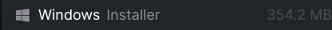
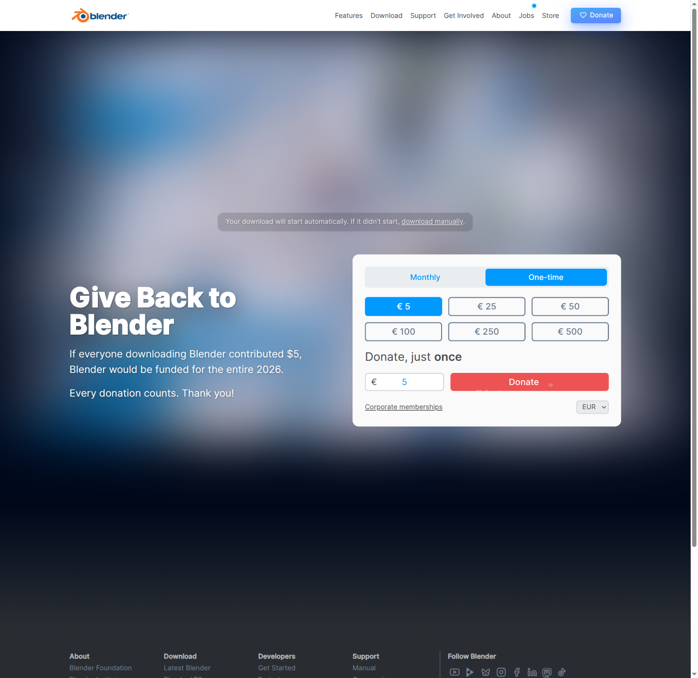
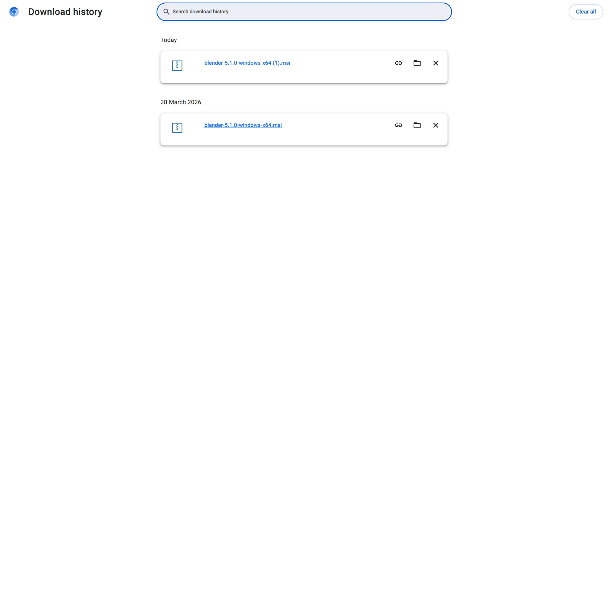
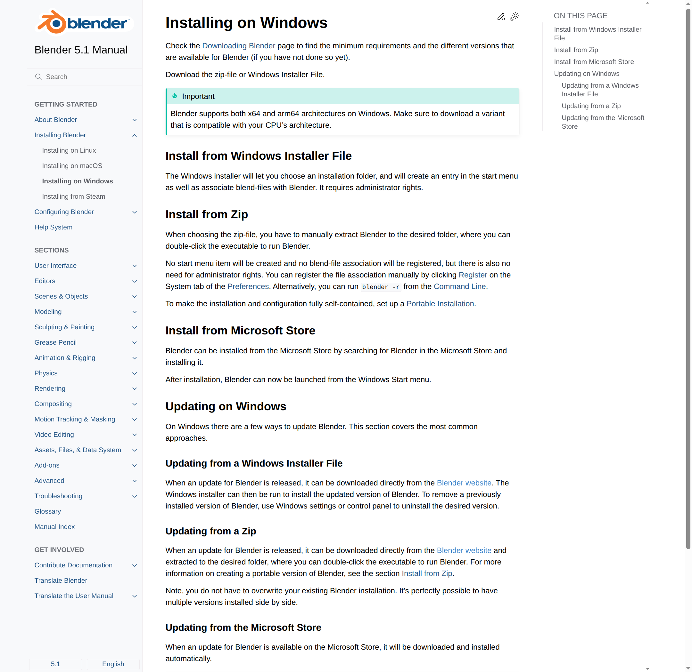

# Installing Blender on Windows

A step-by-step guide to downloading and installing Blender on Windows 10 / 11.

---

## Prerequisites

- Windows 10 or Windows 11 (64-bit recommended)
- An internet browser (Edge, Chrome, Firefox, etc.)
- ~1 GB of free disk space
- Administrator privileges recommended for installation

---

## Step 1: Visit the Blender Download Page

Open your browser and navigate to **https://www.blender.org/download**

You'll land on the official Blender download page.


---

## Step 2: Expand Windows Download Options

Scroll down to view the download options. You'll see the main download section with Linux selected by default.

Click the dropdown button labeled **"Windows, macOS, and other versions"** to reveal all platform options.

---

## Step 3: Select Windows Installer

After expanding the dropdown, you'll see the **Windows** section with several installation options:

| Option | Description | Recommended |
|---|---|---|
| **Windows Installer** | Standard installer (354.2 MB) | ✓ Yes |
| **Windows Portable (.zip)** | Portable version, no installation required | For advanced users |
| **Windows Microsoft Store** | Install via Microsoft Store | Alternative |
| **Windows ARM - Installer** | For ARM-based Windows machines (220.9 MB) | Only if you have ARM CPU |
| **Windows ARM - Portable (.zip)** | ARM portable version | Only if you have ARM CPU |



For most users, click the **Windows Installer** option (354.2 MB) — this is the recommended method.

> **Not sure which to pick?** Choose **Windows Installer** if your PC is a standard 64-bit Windows machine made after 2012.

---

## Step 4: Download Begins

After clicking the installer link, your browser will begin downloading the file.

- The file is named `blender-5.1.0-windows-x64.msi` (or similar, depending on the version)
- File size is approximately 350–370 MB
- You'll see a notification that the download is starting

The browser may show a message like: *"Your download will start automatically. If it didn't start, [download manually](download-link)."*



---

## Step 5: Check Your Downloads

You can monitor the download progress in your browser's download bar or download history.

Open your browser's **Download History** (`Ctrl+Shift+Del` in most browsers) to verify the file is downloading.



Once the download completes, you'll see the file listed as `blender-5.1.0-windows-x64.msi`.

---

## Step 6: Locate the Downloaded File

After the download finishes, locate the `.msi` installer file:

1. Check your **Downloads** folder (usually `C:\Users\{YourUsername}\Downloads`)
2. Or click the download from the history and select "Show in folder"
3. The file should be named something like `blender-5.1.0-windows-x64.msi`

---

## Step 7: Run the Installer

Double-click the `blender-5.1.0-windows-x64.msi` file to launch the Windows Installer.

> If Windows shows a **User Account Control (UAC)** prompt asking *"Do you want to allow this app to make changes to your device?"*, click **Yes** to proceed.



---

## Step 8: Follow the Installation Wizard

The Blender installer will open. Follow these steps:

1. **Accept the License** — Read and accept the Blender license agreement
2. **Choose Installation Location** — The default location is fine for most users:
   ```
   C:\Program Files\Blender Foundation\Blender
   ```
   - To change the location, click **Browse** and select a different folder
3. **Proceed** — Click **Next** or **Install** to continue

The installer will copy files to your system — this typically takes 1–2 minutes.

---

## Step 9: Complete Installation

When the installation completes, you'll see a completion screen. 

- Leave any "Launch Blender" option checked if you want to start it immediately
- Click **Finish** to close the installer

---

## Step 10: Blender is Ready

Blender will launch (if you selected the launch option) or you can start it manually:

- **Start Menu**: Search for "Blender" in your Windows Start Menu and click the icon
- **Desktop Shortcut**: If one was created during installation, double-click it
- **File Explorer**: Navigate to `C:\Program Files\Blender Foundation\Blender` and double-click `blender.exe`

When Blender opens, it will show a splash screen with version information and may ask about GPU rendering preferences.

---

## Default Installation Location

The default installation path on Windows is:

```
C:\Program Files\Blender Foundation\Blender
```

To verify the installation worked, you should see the Blender folder and several files including:

- `blender.exe` (the main application)
- `blenderplayer.exe` (for playing Blender files)
- Various library and resource folders

---

## Post-Installation

Once Blender is installed, you can:

1. **Configure GPU Rendering** (if your system has an NVIDIA or AMD GPU)
   - Open Blender Preferences (`Edit → Preferences`)
   - Navigate to `System → Cycles Render Devices`
   - Select your GPU for faster rendering

2. **Enable Developer Extras** (optional, for advanced features)
   - In Preferences, go to `Interface`
   - Check the "Developer Extras" option

3. **Install Add-ons** (optional)
   - Open Preferences and click `Add-ons`
   - Search for and install community-created extensions

4. **Create Your First Project**
   - File → New → General
   - Start modeling!

---

## Verifying the Installation

To confirm Blender was installed correctly:

1. Open Blender from the Start Menu or desktop shortcut
2. You should see the Blender splash screen with the version number (e.g., "5.1")
3. The main 3D viewport should appear after closing the splash screen
4. You can open files or create new projects

---

## Troubleshooting

| Issue | Solution |
|---|---|
| Installer won't run | Right-click the `.msi` file and choose **Run as administrator** |
| Installation fails | Try downloading again; the file may be corrupted |
| Blender won't start after install | Restart your computer and try launching again |
| GPU rendering not available | Update your graphics drivers; some GPUs may not be supported |
| "File not found" error | Ensure the full file path has no special characters; reinstall if needed |
| Permission denied error | Run the installer as Administrator (right-click → Run as administrator) |

---

## Updating Blender

To update Blender after installation:

1. Visit https://www.blender.org/download once a new version is released
2. Download the latest Windows Installer
3. Run the new installer — it will replace the old version
4. Your user settings and splash screens will be preserved

Alternatively, you can have **multiple versions** of Blender installed side-by-side if you don't overwrite the folder during installation.

---

## Further Reading

- [Blender Official Download Page](https://www.blender.org/download/)
- [Blender Manual - Installing on Windows](https://docs.blender.org/manual/en/latest/getting_started/installing/windows.html)
- [Blender System Requirements](https://www.blender.org/download/requirements/)
- [Blender Getting Started Guide](https://docs.blender.org/manual/en/latest/getting_started/index.html)
