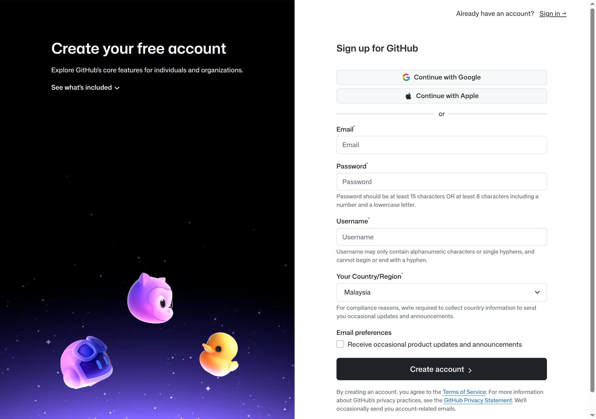
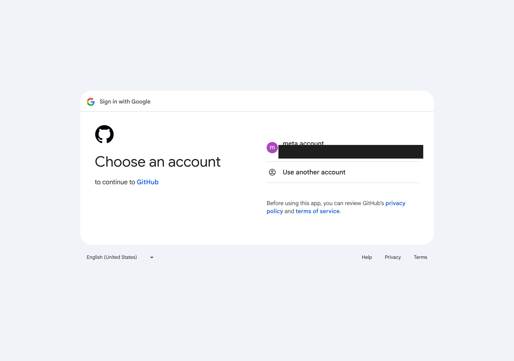
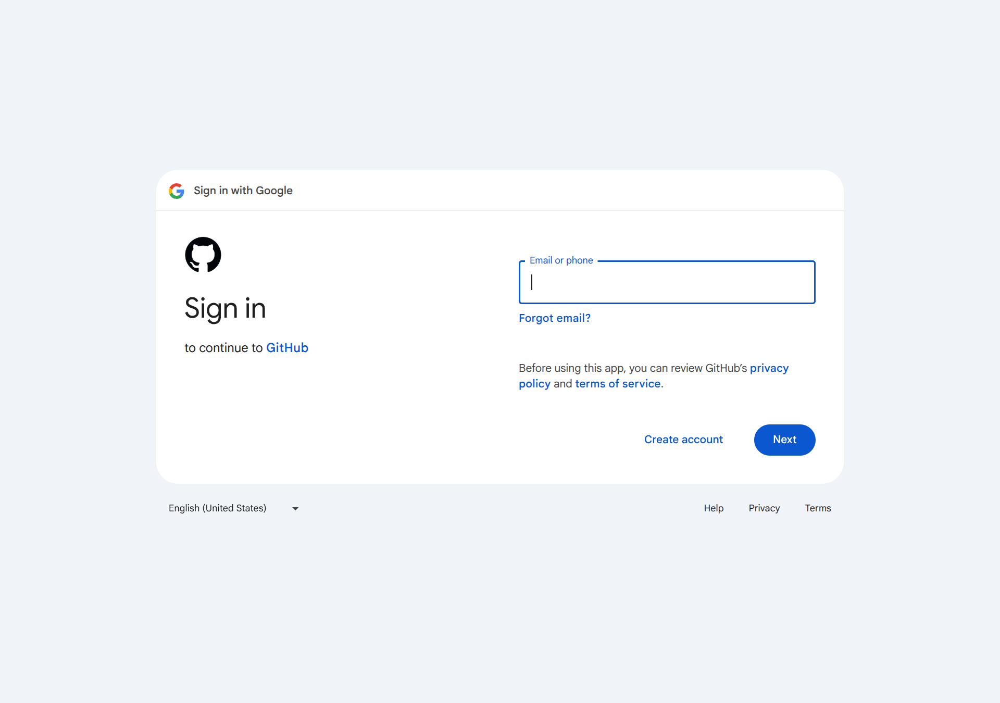
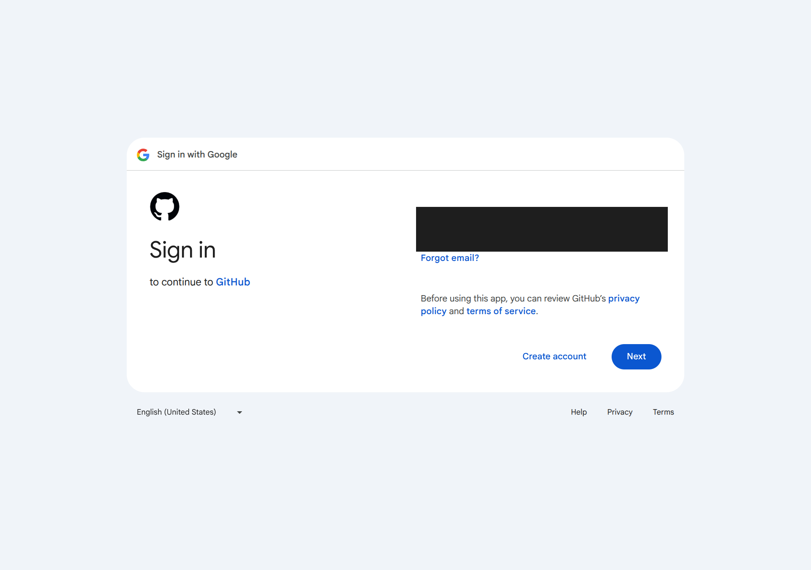
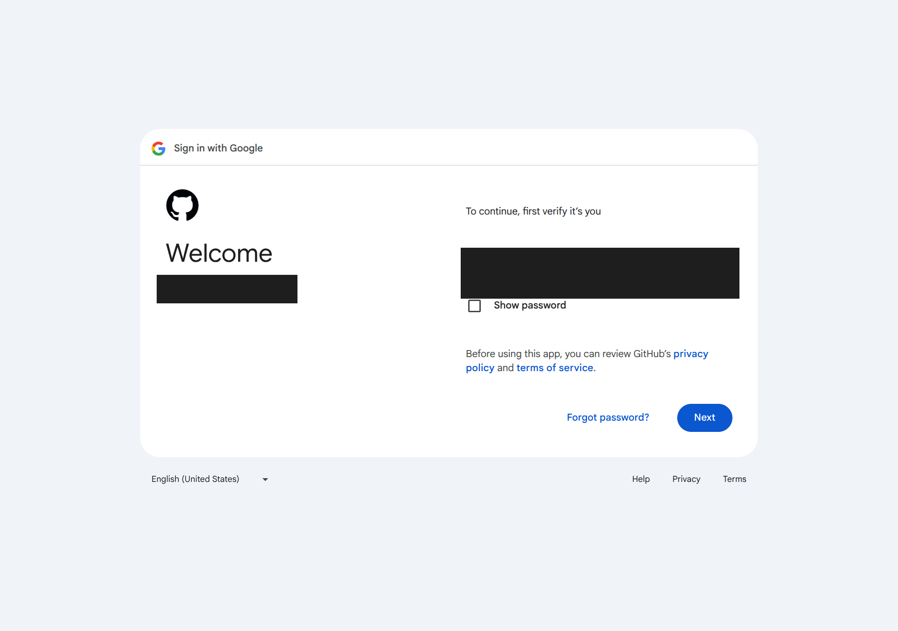
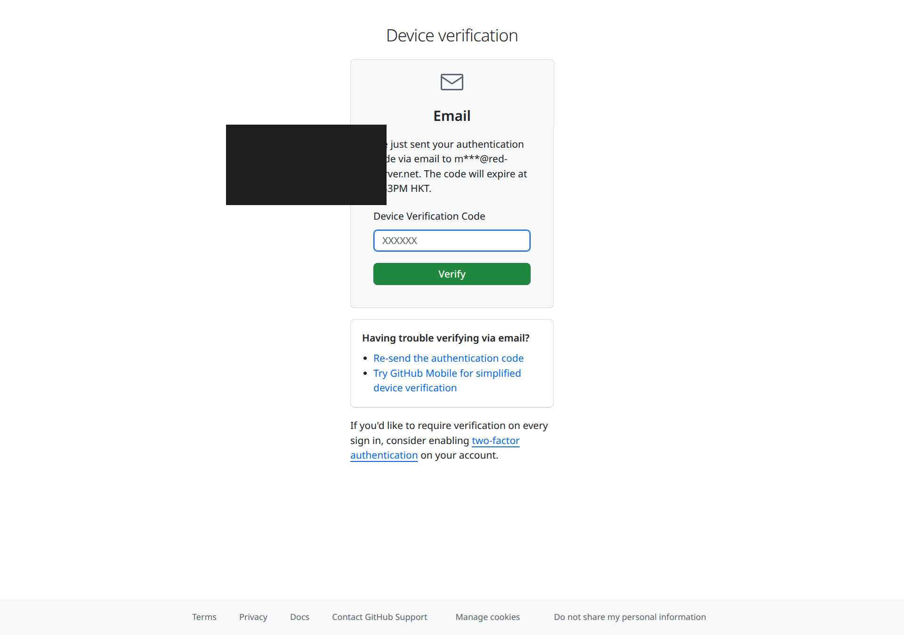

# How to Register a GitHub Account

This guide walks you through creating a GitHub account using an existing Google account — the fastest option that avoids setting a separate password.

---

## Prerequisites

- A Google account
- A web browser

---

## Step 1 — Go to the GitHub Sign-Up Page

Navigate to **https://github.com/signup** in your browser.

You will see the GitHub registration form with two options: sign up with Google/Apple, or create an account manually with email and password.

Click **Continue with Google**.

---

## Step 2 — Sign In with Google

### Option A — Already signed into Google (account chooser)

If your browser is already signed into a Google account, Google will show an account chooser. Select the account you want to link to GitHub.

### Option B — Not yet signed into Google

If you are not signed in, Google will show a standard sign-in form. Enter your Google email address and click **Next**.

---

## Step 3 — Enter Your Google Password

Google will display a **Welcome** screen showing your account name. Enter your Google password in the field provided and click **Next**.

> **Tip:** Check "Show password" if you want to verify what you are typing.

---

## Step 4 — Device Verification

For security, GitHub sends a one-time verification code to your email address. Check your inbox for an email from GitHub, then:

1. Copy the **6-digit code** from the email.
2. Paste it into the **Device Verification Code** field.
3. Click **Verify**.

> **Note:** The code expires after a few minutes. If it expires, click **Re-send the authentication code**.

---

## Step 5 — You're In

After successful verification, you are logged into GitHub. If this is your first time, GitHub may prompt you to:

- Choose a **username** (used in your profile URL: `github.com/<username>`)
- Select a plan (**Free** is sufficient for most users)
- Complete a short onboarding survey (optional — click *Skip* if preferred)

---

## Summary

| Step | Action |
|------|--------|
| 1 | Go to `github.com/signup` |
| 2 | Click **Continue with Google** |
| 3 | Select or sign in to your Google account |
| 4 | Enter your Google password |
| 5 | Enter the verification code sent to your email |
| 6 | Set your username and complete onboarding |

---

## Tips

- **Username** — Choose carefully; it appears in all your repository URLs and cannot be changed easily later.
- **Free plan** — Includes unlimited public and private repositories, making it suitable for personal and open-source projects.
- **Two-factor authentication (2FA)** — GitHub will eventually require 2FA. Set it up early via *Settings → Password and authentication*.
- **Profile** — Add a photo and bio via *Settings → Public profile* to make collaboration easier.
