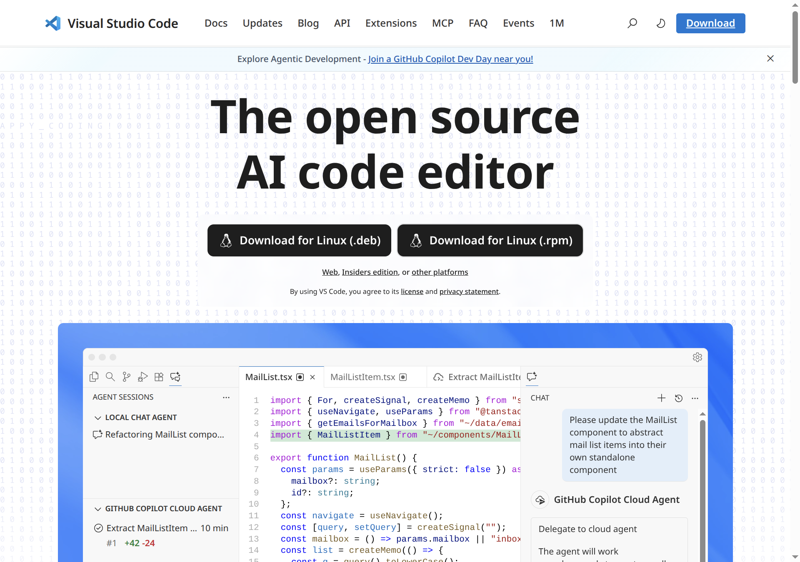
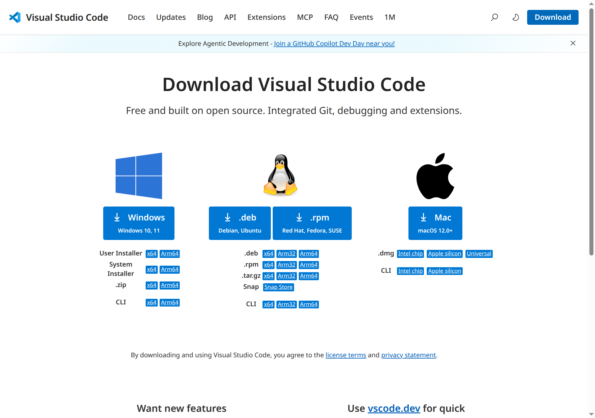
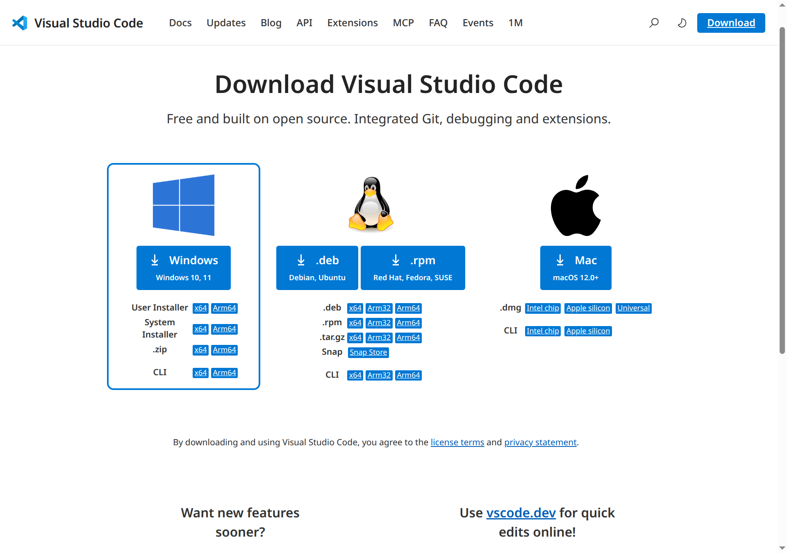
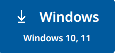
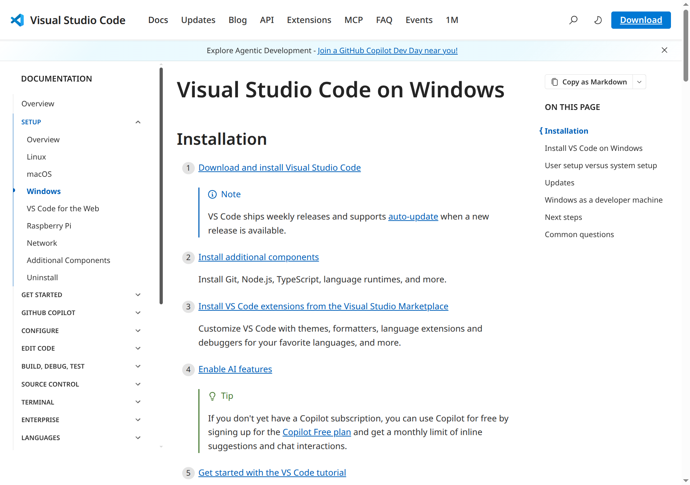

# Installing Visual Studio Code on Windows

A step-by-step guide to downloading and installing Visual Studio Code on Windows 10 / 11.

---

## Prerequisites

- Windows 10 or Windows 11 (64-bit recommended)
- An internet browser (Edge, Chrome, Firefox, etc.)
- ~400 MB of free disk space

---

## Step 1: Open the VS Code Website

Open your browser and navigate to **https://code.visualstudio.com**

You'll land on the official VS Code homepage.



---

## Step 2: Go to the Download Page

Click the **Download** link in the top navigation bar, or click the large download button on the homepage.

This takes you to `https://code.visualstudio.com/Download`.



---

## Step 3: Select the Windows Installer

On the Download page you'll see options for Windows, Linux, and Mac. Locate the **Windows** section at the top-left of the download grid.



VS Code offers two types of installers for Windows:

| Installer Type | Description |
|---|---|
| **User Installer** *(recommended)* | Installs for the current user only. No admin rights required. Auto-updates silently in the background. |
| **System Installer** | Installs for all users on the machine. Requires administrator privileges. |

For most users, click **x64** under **User Installer** — this downloads the recommended `VSCodeUserSetup-x64-{version}.exe`.

> **Not sure which to pick?** Choose **User Installer x64** if your PC is a standard 64-bit Windows machine made after 2012.

### Available download options

- **User Installer** → x64 | Arm64
- **System Installer** → x64 | Arm64
- **.zip** (portable, no installation required) → x64 | Arm64
- **CLI** (command-line only) → x64 | Arm64



---

## Step 4: Wait for the Download to Complete

After clicking the installer link, the browser will start downloading the file.

- The file is named something like `VSCodeUserSetup-x64-1.xx.x.exe`
- File size is approximately 100–110 MB
- You'll see the download progress in your browser's download bar (bottom or top depending on your browser)

Once the download finishes, locate the file in your **Downloads** folder or click **Open file** in the browser's download notification.

---

## Step 5: Run the Installer

Double-click `VSCodeUserSetup-x64-{version}.exe` to launch the Setup Wizard.

> If Windows shows a **User Account Control (UAC)** prompt asking *"Do you want to allow this app to make changes to your device?"*, click **Yes** to proceed.

---

## Step 6: Accept the License Agreement

The first screen of the installer shows the **License Agreement**.

1. Read through the Microsoft license terms
2. Select **I accept the agreement**
3. Click **Next**

```
┌─────────────────────────────────────────────────────────────┐
│  Setup - Visual Studio Code                                  │
│─────────────────────────────────────────────────────────────│
│  License Agreement                                           │
│                                                              │
│  Please read the following important information before      │
│  continuing.                                                 │
│                                                              │
│  [License text scrolls here...]                              │
│                                                              │
│  ● I accept the agreement                                    │
│  ○ I do not accept the agreement                             │
│                                   [Back] [Next >] [Cancel]   │
└─────────────────────────────────────────────────────────────┘
```

---

## Step 7: Choose Installation Location

The next screen lets you choose **where VS Code is installed**.

- The default path is:
  ```
  C:\Users\{YourUsername}\AppData\Local\Programs\Microsoft VS Code
  ```
- This is fine for most users. Click **Next** to continue.
- To change the location, click **Browse...** and select a different folder.

---

## Step 8: Select Start Menu Folder

Choose the **Start Menu folder** where VS Code shortcuts will appear (default: `Visual Studio Code`).

Click **Next** to accept the default.

---

## Step 9: Select Additional Tasks

This is an important step. Check the options you want:

| Option | Recommendation |
|---|---|
| **Create a desktop icon** | Optional — adds a VS Code icon to your desktop |
| **Add "Open with Code" action to Windows Explorer file context menu** | Recommended — right-click any file to open it in VS Code |
| **Add "Open with Code" action to Windows Explorer directory context menu** | Recommended — right-click any folder to open it in VS Code |
| **Register Code as an editor for supported file types** | Recommended |
| **Add to PATH (requires shell restart)** | **Strongly recommended** — lets you type `code .` in any terminal |

```
┌─────────────────────────────────────────────────────────────┐
│  Setup - Visual Studio Code                                  │
│─────────────────────────────────────────────────────────────│
│  Select Additional Tasks                                     │
│                                                              │
│  Additional icons:                                           │
│  [✓] Create a desktop icon                                   │
│                                                              │
│  Other:                                                      │
│  [✓] Add "Open with Code" action to file context menu        │
│  [✓] Add "Open with Code" action to directory context menu   │
│  [✓] Register Code as an editor for supported file types     │
│  [✓] Add to PATH (requires shell restart)                    │
│                                                              │
│                                   [Back] [Next >] [Cancel]   │
└─────────────────────────────────────────────────────────────┘
```

Click **Next** after making your selections.

---

## Step 10: Begin Installation

A summary screen shows your chosen settings. Click **Install** to begin.

The installer will copy files and configure VS Code — this typically takes 30–60 seconds.

```
┌─────────────────────────────────────────────────────────────┐
│  Setup - Visual Studio Code                                  │
│─────────────────────────────────────────────────────────────│
│  Installing                                                  │
│                                                              │
│  Please wait while Setup installs Visual Studio Code on      │
│  your computer.                                              │
│                                                              │
│  Extracting files...                                         │
│  ████████████████████░░░░░░░  72%                            │
│                                                              │
└─────────────────────────────────────────────────────────────┘
```

---

## Step 11: Finish and Launch VS Code

When the installation completes, you'll see the **Completing the Visual Studio Code Setup Wizard** screen.

- Leave **Launch Visual Studio Code** checked
- Click **Finish**

VS Code will open automatically.

---

## Step 12: VS Code is Ready

VS Code launches and shows the **Welcome** tab. You're all set!



From here you can:

- Install **extensions** from the Extensions panel (`Ctrl+Shift+X`)
- Open a **folder or project** via `File → Open Folder...`
- Sign in with your **GitHub or Microsoft account** for Settings Sync
- Enable **GitHub Copilot** for AI-assisted coding

---

## Default Installation Location

| Installer Type | Default Path |
|---|---|
| User Installer | `C:\Users\{Username}\AppData\Local\Programs\Microsoft VS Code` |
| System Installer | `C:\Program Files\Microsoft VS Code` |

---

## Verifying the Installation

Open **Command Prompt** or **PowerShell** (restart it if it was already open) and run:

```powershell
code --version
```

You should see output like:

```
1.9x.x
xxxxxxxxxxxxxxxxxxxxxxxxxxxxxxxxxxxxxxxx
x64
```

You can also open any folder directly from the terminal:

```powershell
code .
```

---

## Updating VS Code

VS Code auto-updates in the background. When a new version is available, you'll see a notification badge on the gear icon in the bottom-left corner. Click it and select **Restart to Update**.

---

## Troubleshooting

| Issue | Solution |
|---|---|
| Installer won't run | Right-click the `.exe` and choose **Run as administrator** |
| `code` command not found in terminal | Restart your terminal after install; re-run setup and ensure **Add to PATH** is checked |
| Installation fails | Try the `.zip` portable version: extract to `AppData\Local\Programs` and run `Code.exe` |
| Updates not working when running as admin | Use the User Installer (not System Installer) or avoid running VS Code as Administrator |

---

## Further Reading

- [VS Code Windows Setup Documentation](https://code.visualstudio.com/docs/setup/windows)
- [VS Code Tips and Tricks](https://code.visualstudio.com/docs/getstarted/tips-and-tricks)
- [VS Code Extensions Marketplace](https://marketplace.visualstudio.com/VSCode)
